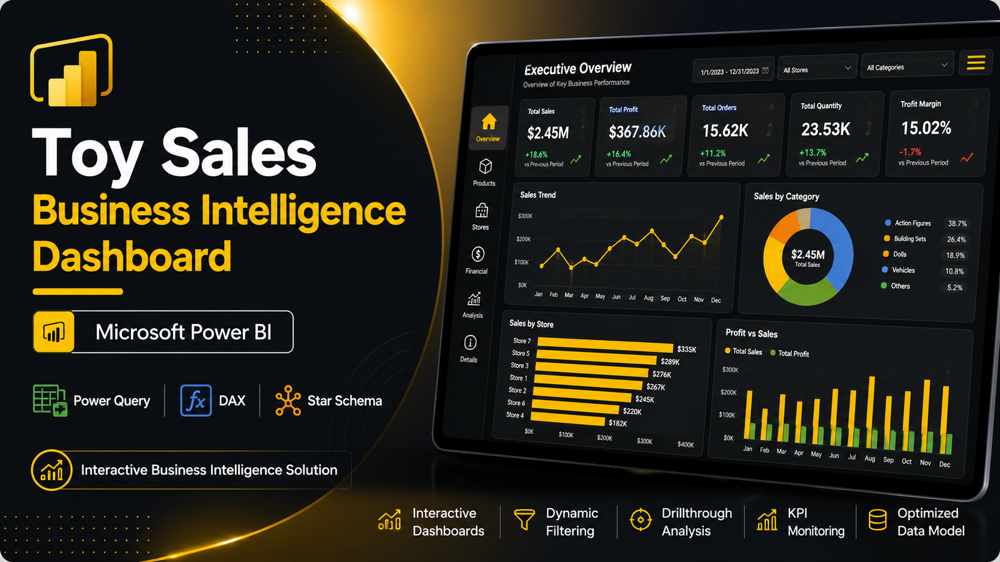
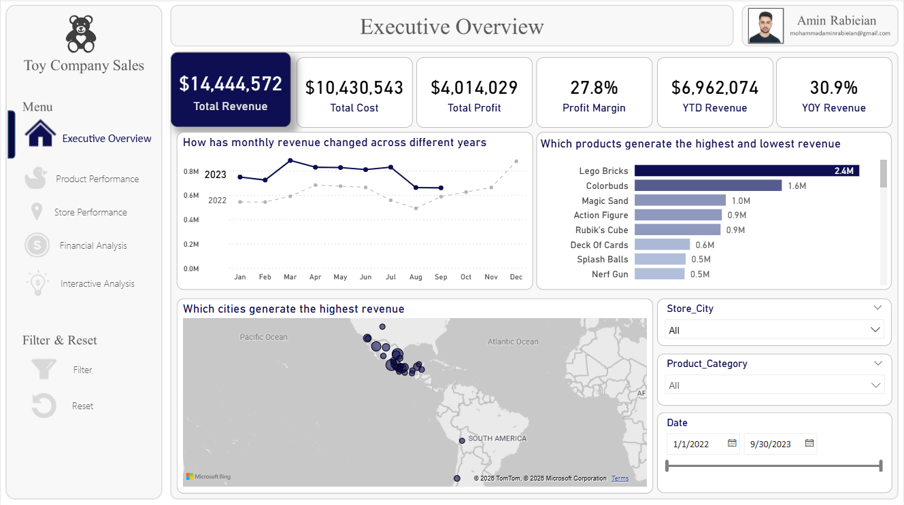
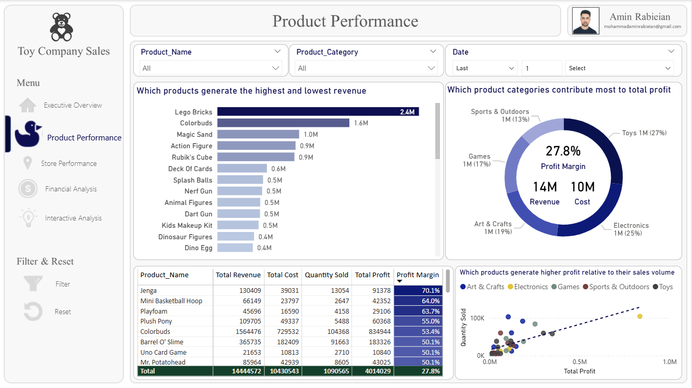
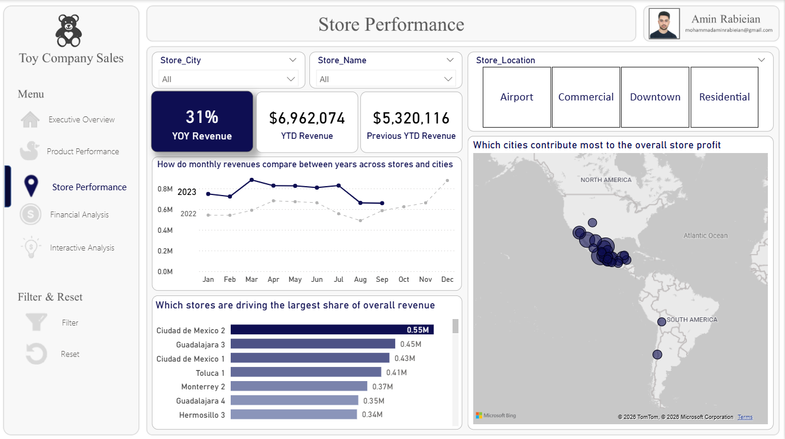
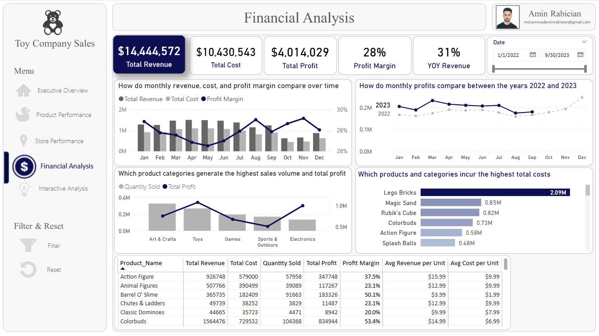
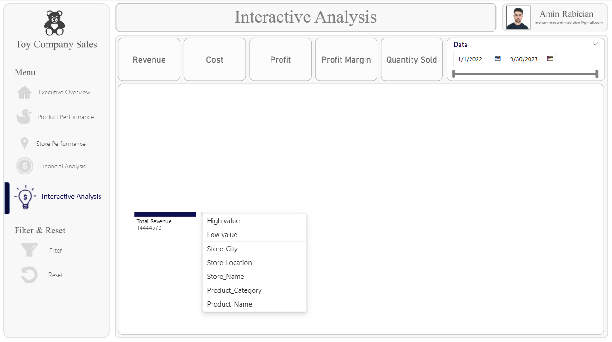
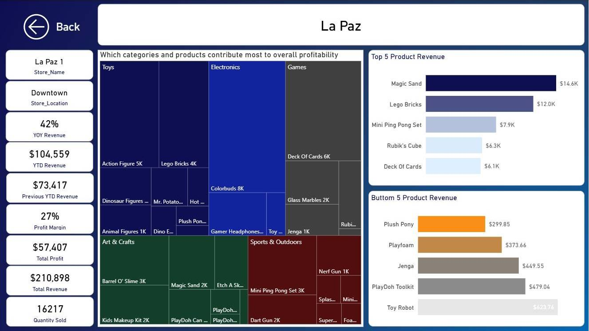
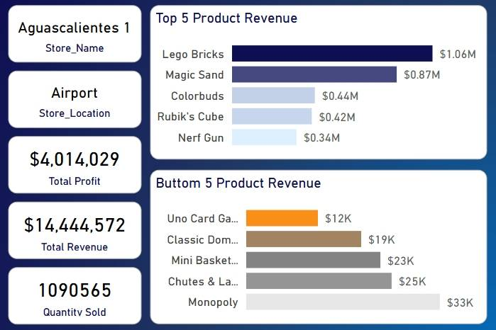
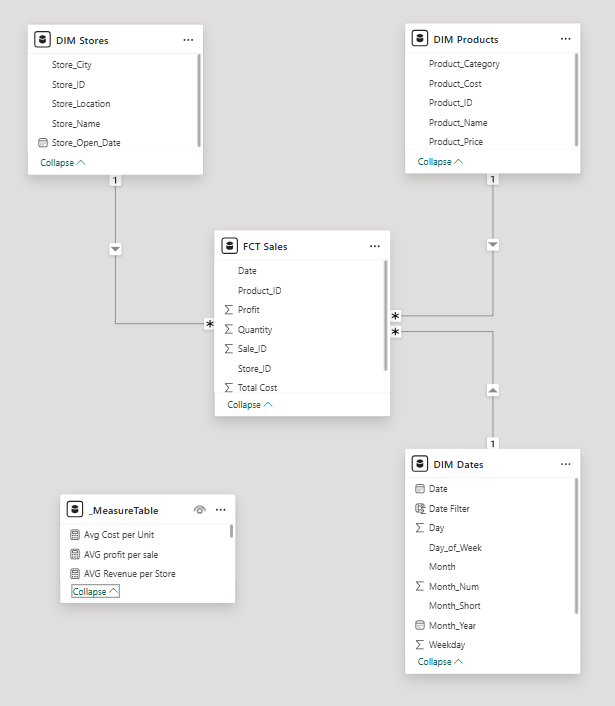

<div align="center">

# 📊 Toy Sales Business Intelligence Dashboard

### End-to-End Business Intelligence Solution Developed with Microsoft Power BI

<p align="center">

</p>

<p>


</p>

*A complete Business Intelligence solution for analyzing sales performance, profitability, products, and store operations using Microsoft Power BI.*

</div>

---

# 📌 Overview

This repository showcases a complete Business Intelligence solution built with **Microsoft Power BI** to analyze sales data for a toy retail company.

The project transforms raw transactional data into interactive dashboards that support strategic and operational decision-making through modern Business Intelligence techniques.

The solution combines:

- Data Modeling
- Power Query (ETL)
- DAX Calculations
- Interactive Dashboards
- KPI Monitoring
- Drill-through Analysis
- Business Performance Reporting

The dashboard enables stakeholders to monitor business performance, evaluate profitability, identify top-performing products and stores, and discover valuable business insights through interactive visualizations.

---

# 🎯 Business Problem

Organizations generate large volumes of sales data every day.

Without an integrated reporting solution, business users often rely on spreadsheets and manual analysis, making it difficult to answer critical questions such as:

- Which stores generate the highest revenue?
- Which products perform best?
- Which product categories contribute most to total sales?
- How profitable is the business?
- Which stores require immediate attention?
- How are sales changing over time?
- Which products should receive greater business focus?

Manual reporting is time-consuming, difficult to maintain, and often lacks the flexibility required for fast business decisions.

This project addresses these challenges by delivering a centralized, interactive, and scalable Business Intelligence dashboard.

---

# 🎯 Business Objectives

The dashboard was designed to achieve the following objectives:

- Monitor overall business performance.
- Track key performance indicators (KPIs).
- Analyze sales trends over time.
- Compare store performance.
- Evaluate product performance.
- Measure profitability.
- Support data-driven decision making.
- Improve business visibility through interactive reporting.

---

# ⭐ Project Highlights

✔ Executive Dashboard

✔ Product Performance Analysis

✔ Store Performance Analysis

✔ Financial Analysis

✔ Interactive Dashboard Navigation

✔ Drill-through Reports

✔ Dynamic Filtering

✔ KPI Monitoring

✔ Star Schema Data Model

✔ Power Query Data Transformation

✔ Advanced DAX Measures

✔ Interactive Visualizations

✔ Business-Oriented Dashboard Design

---

# 📸 Executive Dashboard

<p align="center">

</p>

The Executive Dashboard provides a comprehensive overview of business performance by combining KPIs, trend analysis, revenue monitoring, and profitability metrics into a single interactive report.

It serves as the primary entry point for business users, enabling rapid assessment of overall company performance before exploring detailed analytical pages.

---

# 📑 Dashboard Pages

The report consists of multiple analytical pages, each designed to answer a specific business question and support different levels of decision-making.

---

## 📊 Executive Overview

<p align="center">

</p>

The Executive Overview page provides a high-level summary of the company's overall performance.

It enables decision-makers to quickly evaluate:

- Business performance
- Revenue trends
- Profitability
- Key Performance Indicators (KPIs)
- Overall sales status

---

## 📦 Product Performance

<p align="center">

</p>

This page focuses on product analytics and helps identify:

- Best-selling products
- Product revenue
- Product profitability
- Category performance
- Product comparison

The page enables users to evaluate which products contribute the most to business growth.

---

## 🏬 Store Performance

<p align="center">

</p>

This report compares the performance of individual stores.

Business users can analyze:

- Store revenue
- Store profit
- Store ranking
- Sales comparison
- Performance by location

---

## 💰 Financial Analysis

<p align="center">

</p>

The Financial Analysis page provides detailed financial insights including:

- Revenue analysis
- Profit analysis
- Profit margin
- Financial trends
- Business growth indicators

---

## 📈 Interactive Analysis

<p align="center">

</p>

This page allows users to explore the dataset interactively using:

- Dynamic slicers
- Cross-filtering
- Visual interactions
- Custom exploration
- Flexible business analysis

---

## 🏪 Store Details

<p align="center">

</p>

The Store Details page provides an in-depth analysis of an individual store.

Users can review detailed metrics, sales performance and operational information for a selected store.

---

## 🔍 Store Drillthrough

<p align="center">

</p>

The Drillthrough page enables users to navigate from summary reports to detailed store-level information.

This improves analytical flexibility and allows deeper investigation into business performance.

---

# 📈 Key Performance Indicators

The dashboard tracks a comprehensive collection of business KPIs.

| Category | KPIs |
|----------|------|
| Sales | Total Sales, Orders, Units Sold |
| Financial | Revenue, Profit, Profit Margin |
| Products | Best Selling Products, Category Performance |
| Stores | Store Revenue, Store Profit, Store Ranking |
| Business | Sales Trend, Revenue Trend, Growth |

---

# ✨ Dashboard Features

The project includes the following Business Intelligence capabilities.

## 📊 Reporting

- Executive Dashboard
- Financial Dashboard
- Product Dashboard
- Store Dashboard
- Interactive Analysis

## 📈 Analytics

- Trend Analysis
- Comparative Analysis
- Performance Monitoring
- KPI Tracking
- Business Insights

## 🎛 Interactive Features

- Dynamic Slicers
- Cross Filtering
- Drillthrough Navigation
- Interactive Visuals
- Responsive Dashboard Experience

## ⚙ Technical Features

- Star Schema Data Model
- Power Query ETL
- DAX Measures
- Optimized Relationships
- Interactive Navigation
- Performance-Oriented Design

---

# 🏗 Data Model

The report follows a **Star Schema** design to improve model performance, simplify maintenance, and support scalable Business Intelligence solutions.

<p align="center">

</p>

## Model Architecture

The model consists of one fact table and multiple dimension tables.

| Table | Role |
|--------|------|
| Sales | Fact Table |
| Products | Dimension |
| Stores | Dimension |
| Calendar | Date Dimension |
| Measures | DAX Measures |

---

## Design Principles

The data model follows these best practices:

- Star Schema Architecture
- One-to-Many Relationships
- Single Direction Filtering
- Dedicated Measures Table
- Optimized Data Types
- Clean Relationship Structure
- High Query Performance

---

# 📂 Dataset

The dashboard is built using three CSV datasets.

| File | Description |
|------|-------------|
| sales.csv | Sales transactions |
| products.csv | Product information |
| stores.csv | Store information |

Dataset location:

```text
dataset/
├── sales.csv
├── products.csv
├── stores.csv
└── dataset-information.md
```

---

# 🔄 Data Preparation

Data preparation was completed using **Power Query** before loading the data into the semantic model.

The ETL workflow includes:

- Importing CSV files
- Data type conversion
- Data cleaning
- Removing unnecessary columns
- Handling missing values
- Renaming columns
- Creating calculated columns
- Preparing relationships
- Optimizing model quality

Detailed documentation is available in:

```text
power-query/transformations.md
```

---

# 🧠 DAX Measures

Business logic is implemented using DAX measures.

The report includes calculations for:

### Sales Metrics

- Total Sales
- Total Orders
- Total Quantity Sold

### Financial Metrics

- Total Profit
- Profit Margin
- Average Order Value

### Product Metrics

- Product Ranking
- Product Revenue
- Category Performance

### Store Metrics

- Store Revenue
- Store Profit
- Store Ranking

### Time Intelligence

- Monthly Analysis
- Year-to-Date (YTD)
- Running Totals
- Trend Analysis

Complete DAX documentation is available in:

```text
dax/measures.md
```

---

# 💻 Technology Stack

| Category | Technology |
|-----------|------------|
| BI Platform | Microsoft Power BI Desktop |
| Data Transformation | Power Query |
| Data Modeling | Star Schema |
| Calculations | DAX |
| Data Source | CSV Files |
| Version Control | Git |
| Repository Hosting | GitHub |

---

# 📁 Repository Structure

```text
PowerBI-Toy-Sales-Analysis
│
├── README.md
├── LICENSE
├── .gitignore
│
├── pbix/
│   └── PowerBI-Toy-Sales-Analysis.pbix
│
├── dataset/
│   ├── sales.csv
│   ├── products.csv
│   ├── stores.csv
│   └── dataset-information.md
│
├── images/
│   ├── executive-overview.png
│   ├── product-performance.png
│   ├── store-performance.png
│   ├── financial-analysis.png
│   ├── interactive-analysis.png
│   ├── store-details.jpg
│   ├── store-drillthrough.jpg
│   └── data-model.png
│
├── documentation/
│   ├── project-overview.md
│   ├── dashboard-pages.md
│   ├── data-model.md
│   └── dax-measures.md
│
├── dax/
│   └── measures.md
│
└── power-query/
    └── transformations.md
```

---

# 🚀 Getting Started

## Clone the Repository

```bash
git clone git@github.com:Amin-tech11/PowerBI-Toy-Sales-Analysis.git
```

---

## Open the Project

Open the Power BI report located at:

```text
pbix/PowerBI-Toy-Sales-Analysis.pbix
```

using **Microsoft Power BI Desktop**.

---

## Dataset

If Power BI requests the data source location, reconnect the files stored in the `dataset` folder.

---

# 📖 Documentation

Additional technical documentation is available in the following directories.

| Folder | Description |
|---------|-------------|
| documentation | Project documentation |
| dataset | Dataset documentation |
| dax | DAX documentation |
| power-query | Power Query documentation |

---

# 🎯 Why This Project

This project was developed to demonstrate the implementation of an end-to-end Business Intelligence solution using Microsoft Power BI.

It showcases the complete BI workflow, including:

- Data preparation with Power Query
- Data modeling using a Star Schema
- Business calculations with DAX
- Interactive dashboard development
- KPI design
- Business performance analysis
- Data storytelling

The project reflects industry best practices for building scalable, maintainable and interactive Power BI reports.

---

# 💼 Skills Demonstrated

This project demonstrates practical experience in the following areas:

### Business Intelligence

- Business Performance Reporting
- KPI Development
- Data Storytelling
- Decision Support

### Data Modeling

- Star Schema Design
- Relationship Management
- Data Model Optimization

### Data Transformation

- ETL Process
- Power Query
- Data Cleaning
- Data Validation

### DAX

- Business Measures
- Aggregations
- Ranking
- Time Intelligence
- Performance Optimization

### Dashboard Development

- Interactive Reports
- Drillthrough Navigation
- Cross Filtering
- User Experience Design

### Version Control

- Git
- GitHub
- Repository Documentation

---

# 🚀 Future Improvements

Potential enhancements for future versions include:

- Power BI Service Deployment
- Row-Level Security (RLS)
- Incremental Refresh
- Forecasting
- Customer Segmentation
- Geographic Analysis
- Mobile Layout Optimization
- Automated Data Refresh
- Advanced Time Intelligence
- Executive Scorecards

---

# 📄 Project Documentation

Additional documentation is included in this repository.

| Document | Description |
|----------|-------------|
| project-overview.md | Project overview |
| dashboard-pages.md | Dashboard page descriptions |
| data-model.md | Data model documentation |
| dax-measures.md | DAX implementation overview |
| dataset-information.md | Dataset description |
| transformations.md | Power Query transformations |
| measures.md | DAX measures documentation |

---

# 📌 Requirements

To run this project you will need:

- Microsoft Power BI Desktop
- Windows Operating System
- CSV datasets included in this repository

---

# 🤝 Contributing

Contributions, suggestions and improvements are welcome.

If you would like to improve this project, feel free to fork the repository and submit a pull request.

---

# 👨‍💻 Author

**Mohammad Amin Rabieian**

Business Intelligence & Data Analytics

GitHub: **https://github.com/Amin-tech11**

---

# ⭐ Support

If you found this project useful, consider giving the repository a ⭐ on GitHub.

It helps increase the visibility of the project and supports future development.

---

# 📜 License

This project is licensed under the MIT License.

See the `LICENSE` file for more details.